# Glamour Salon Management System


The **Glamour Salon Management System** is a web-based platform for managing salon appointments, products, orders, and customer accounts. It provides an efficient way to handle customer interactions, staff scheduling, and online payments using the PayHere.

## Features

- **User-Friendly UI**: Responsive and visually appealing home, about, and contact pages.
- **Product Catalog**: Filter products by categories and price.
- **Service List**: Detailed service list with member and standard pricing options.
- **Blog Section**: Articles on hair care, grooming tips, and related topics.
- **Shopping Cart & Checkout**: A complete shopping experience with secure payments.
- **Payment Gateway Integration**: PayHere for secure payments.
- **Appointment Booking**: Customers can easily book appointments and manage schedules.
- **Order Management**: Track orders, view status, download invoices as PDF, and handle cancellations.
- **User Profile Management**: Customers can manage their account details, wishlists, and passwords.
- **Admin Panel**: Manage users, services, products, appointments, and blog articles from a centralized dashboard.

## Installation (Using Docker and Composer)

### Step 1: Clone the Repository
First, clone the repository from GitHub using the following command:

```bash
git clone https://github.com/hirunaofficial/salon-management-system.git
```

### Step 2: Navigate to the Project Directory
Move into the project directory after cloning:

```bash
cd salon-management-system
```

### Step 3: Install Composer Dependencies
Make sure you have **Composer** installed on your machine. Run the following command to install the necessary PHP dependencies:

```bash
composer install
```

### Step 4: Create and Configure `.env` File

Copy the `.env.example` file to `.env` and set your environment variables for the application, such as database, email, and PayHere configurations:

```bash
cp .env.example .env
```

```
# Database settings
MYSQL_DATABASE=your_database_name
MYSQL_USER=your_database_user
MYSQL_PASSWORD=your_database_password

# PayHere API
PAYHERE_MERCHANT_ID=your_payhere_merchant_id
PAYHERE_MERCHANT_SECRET=your_payhere_merchant_secret
PAYHERE_RETURN_URL=http://localhost/return.php
PAYHERE_CANCEL_URL=http://localhost/cancel.php
PAYHERE_NOTIFY_URL=http://localhost/notify.php

# Port settings
APP_PORT=8080
DB_PORT=3306
PHPMYADMIN_PORT=8082
```

### Step 5: Build and Run Docker Containers

Now that the `.env` file is configured, build and run the Docker containers by using Docker Compose:

```bash
docker-compose up --build
```

### Step 6: Access the Application

Once the containers are running, you can access the application through the following URLs:

- **Salon Management App**: `http://localhost:8080`
- **phpMyAdmin**: `http://localhost:8082`

The environment variables in the `.env` file will determine the ports being used.

## Technologies Used

- **Frontend**: HTML, CSS, Bootstrap
- **Backend**: PHP
- **Database**: MySQL
- **Payment Gateway**: PayHere Sandbox API
- **Additional Libraries**: PHPMailer, FPDF, Dotenv
- **Containerization**: Docker
- **Version Control**: Git, GitHub

## Screenshots

## Screenshots

### Home Page
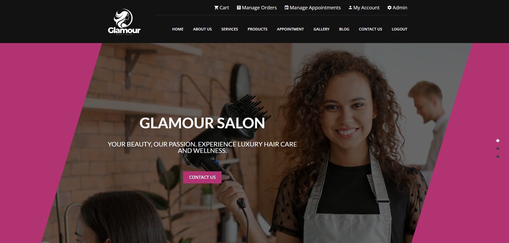

### About
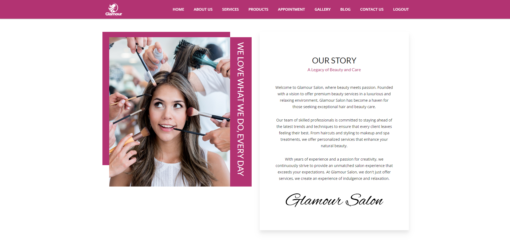

### Manage Appointments
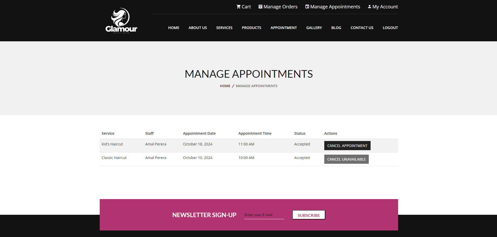

### Manage Orders
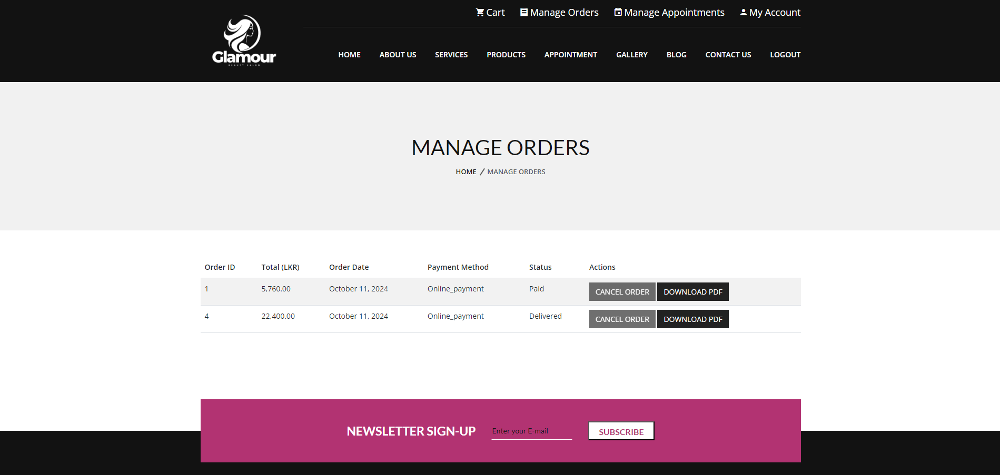

### My Account
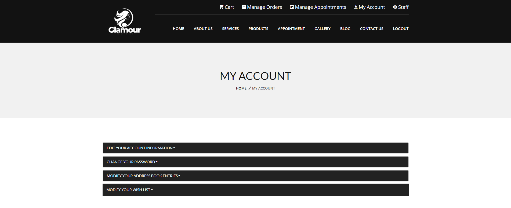

### Products
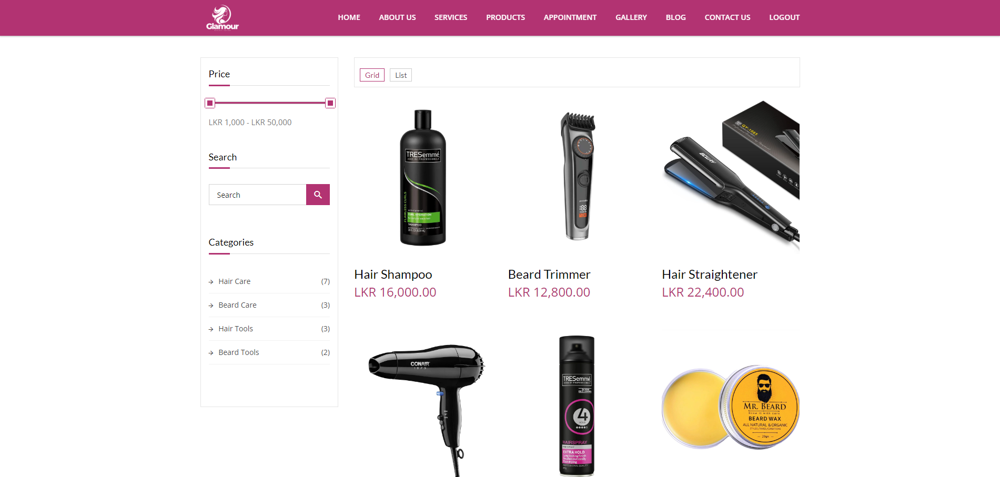

### Services
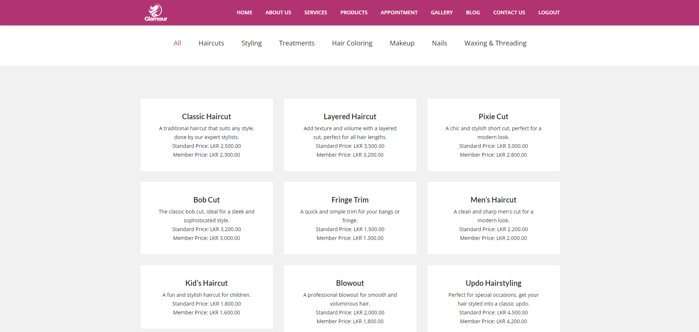

### Appointment
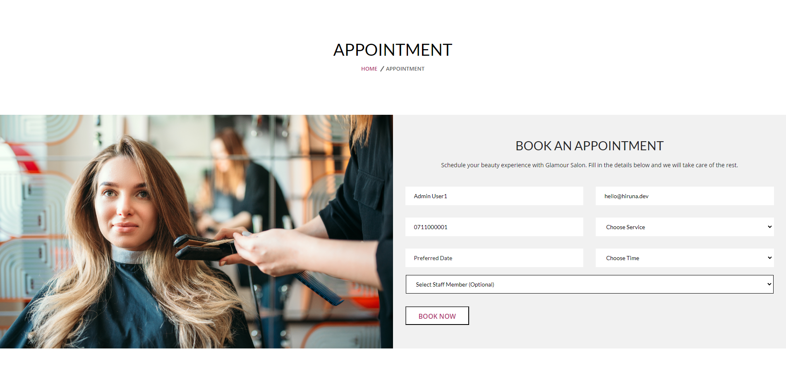

### Shopping Cart
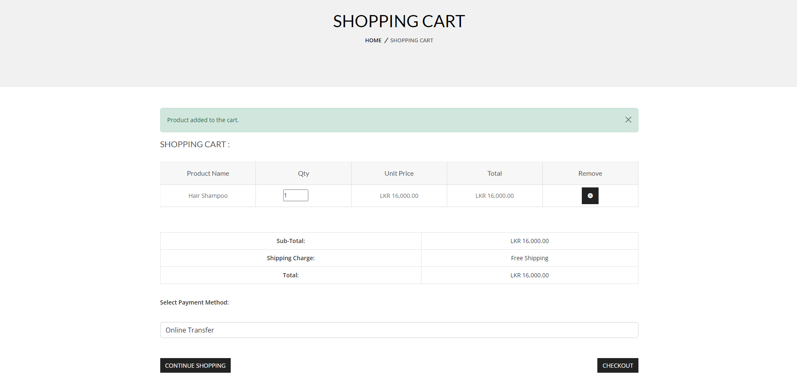

### Payment Gateway


### Order Confirmation
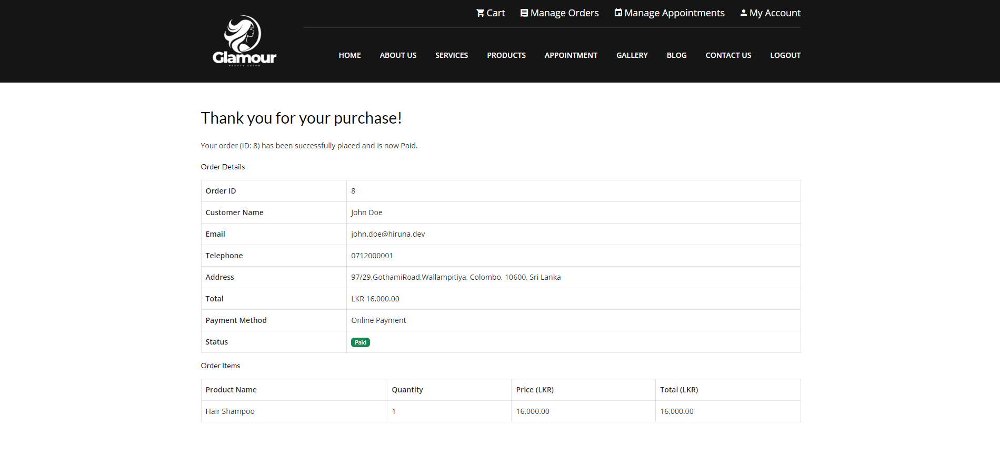

### Blog
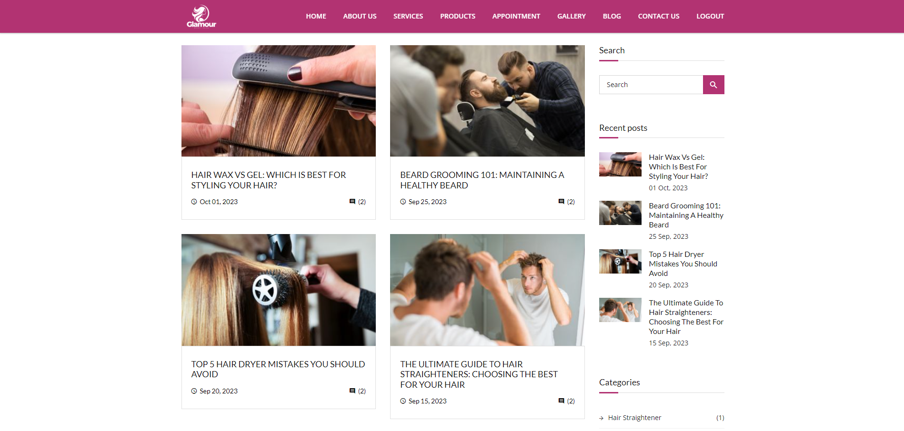

### Gallery


## Admin and Staff Dashboard

The system includes dedicated dashboards for admins and staff members.

### Admin Dashboard
- **Manage Users**: View, edit, and delete users.
- **Manage Services**: Add, edit, or remove salon services.
- **Manage Products**: Handle inventory and product details.
- **Manage Orders**: Track orders and manage their statuses.
- **Manage Blog**: Create and update blog articles.
- **Manage Appointments**: Oversee customer appointments and schedules.
- **Dashboard Metrics**: Display metrics like total users, orders, and appointments.

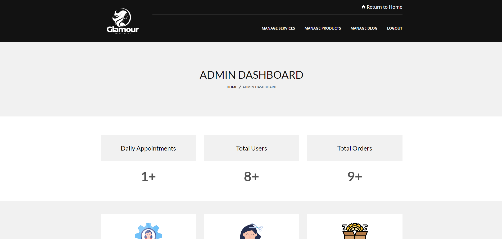
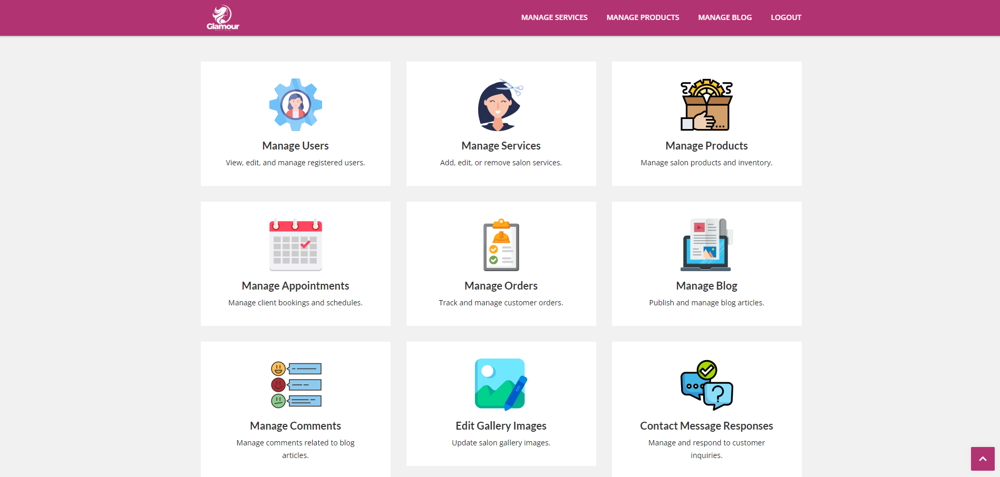

### Staff Dashboard
- **Manage Appointments**: Staff can manage their own appointments through the dashboard.
- **Daily Appointments Overview**: Staff can view their scheduled appointments for the day.


## License

This project is licensed under the MIT License. See the LICENSE file for details.

### Contact

- Author: Hiruna Gallage
- Website: [hiruna.dev](https://hiruna.dev)
- Email: [hello@hiruna.dev](mailto:hello@hiruna.dev)
